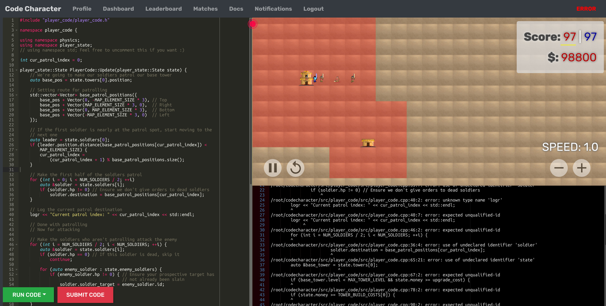

========
Overview
========

Hello, and welcome to the player documentation for Code Character!

Code Character is a programming strategy game where you control troops in a turn-based game with code you write - in our favorite language C++ :)

Let's get started with a quick tutorial on how to get started. If you'd rather start with the rules and documentation, you can start `here <rules.html>`_ instead.

Quick Start
===========

Dashboard Interface
-------------------

Once you log in, you'll see your dashboard, as shown in the image below

  The Dashboard

**On the left is the editor**, where you can type your code. You'll notice on logging in, that you're provided some default code. It doesn't do much in terms of strategy, but it uses most of the important elements of the code API, so a quick read through it will help.

**On the bottom right is the debug window**. It shows your compilation errors at compile time and your debug logs and errors at runtime.

**On the top right is the renderer window**, which actually displays your game. Use the Arrow Keys to pan and the '+' and '-' keys to zoom in and out of the window. The reset button will restart the game view.

We'll begin with a quick run through of the concepts.

Quick Game Rules
----------------

Code Character is a game of strategic territory control, through the battle of troops and the construction of towers. The objective of the game is to build your towers such that you control the maximum amount of territory, represented as colored grids on the map.

Building a tower causes the land around the tower to become your territory as long as the tower is standing, but the catch is that you can only build towers on territory you already own! So, you're given one invincible base tower, which also serves as the respawn point for your soldiers.

Speaking of soldiers, you're given a fixed number. Your soldiers can move and attack opponent towers and soldiers, which rewards you with money. You can use your money to construct more towers and upgrade your existing towers. Upgrading a tower results in an expansion of territory and an increase in HP.

This is probably enough for you to get a start, but you might want to take the time to read the complete rules in the rules section.

Quick Code Guide
----------------

The way you interact with the game is through your code for the ``Update`` function, which is called every turn of the game. Here, you can issue commands to your soldiers, and build, upgrade, or destroy your towers.

All the data about the current state of the game is stored in a variable called ``state``. This is variable is simply a struct, and so you can read any of its members. The ``state`` is also how you'll represent the output of your code, which will be in the form of command variables that you set each turn.

Let's look at a few examples - ::

	// Getting the id of the first soldier
	// Notice that you can use the auto keyword in place of a concrete type
	auto soldier_id = soldiers[0];
	
	
	// Getting the hp of the last soldier
	// Notice that constants like NUM_SOLDIERS are available
	auto soldier_id = soldiers[NUM_SOLDIERS - 1];
	

	// Checking if the last grid of the map is valid to build a tower on
	if (map[MAP_SIZE - 1][MAP_SIZE - 1].valid_territory) ...
	

	// Issuing a command to build a tower at grid (4, 7)
	map[4][7].build_tower = true;
	

	// Issuing a command to move all soldiers to (3, 9)
	// Notice that range-based for loops can be used
	for (auto &soldier : soldiers) soldier->destination = Vector(3, 9);
	

	// Issuing a command to your first soldier to attack the first enemy soldier
	soldiers[0].soldier_target = state.opponent_soldiers[0];

	// Issuing a command to upgrade the second tower.
	// Use num_towers to get how many towers you actually have
	towers[1].upgrade_tower = true;

	// Issuing a command to suicide your own tower
	// You get about a third of the build cost and upgrades back
	towers[0].suicide = true;

	// Return the state you've issued commands to at the END of your code
	return state;

For more information about ``state``, check the `player state <player_state.html>`_ page.

Quick Competition Guide
-----------------------

Ultimately, Code Character is a game of competition! The objective is to challenge other players and fight your way to the top of the leaderboard. To help you along this process, we offer pre-programmed AIs, against which you can test your code. Additionally, you can also try testing your code against itself!

This is done through the opponent selection interface in **Run Code**

  Buttons to **Run code** for testing, and **Submit Code** for competition

Once you're satisfied with your code and want to compete on the leaderboard, hit **Submit Code**. This will freeze the current version of your code and let you challenge anyone who has also submitted code to the leaderboard. To challenge another player, simply click the challenge button next to their nickname on the leaderboard.

Note that once you submit code, anyone can challenge you at anytime, and a match will automatically be simulated between you and the opposing player. You will receive a notification once the match ends, and you can view it in the **Matches** tab.

After submitting code, you can continue editing it. Only the submitted version of your code will be used for challenges. You can update your submitted code simply by submitting again.

The leaderboard evaluates your position using your rating, which is based purely on the outcomes of your matches with other players. The stronger your opponent, the better your reward.
