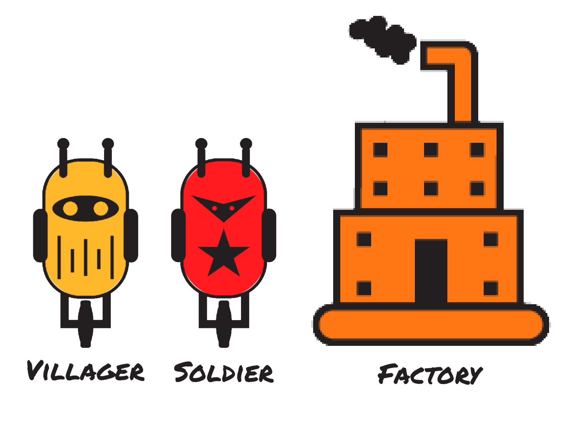
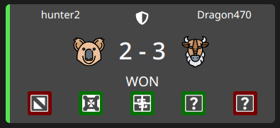

========
Overview
========

Hello, and welcome to the player documentation for **Code Character**!

.. centered::

Code Character is a programming strategy game where you control troops in a turn-based game with code you write - in our favorite language C++ :)

Let's get started with a quick tutorial on how to get started. If you'd rather start with the rules and documentation, you can start the `Rules <rules.html>`_ instead.

Quick Start
===========

Dashboard Interface
-------------------

Once you log in, you'll see your dashboard, as shown in the image below

.. figure:: images/dashboard.png
  :alt: Code Character Dashboard

**On the left is the editor**, where you can type your code. You'll notice on logging in, that you're provided some default code. It doesn't do much in terms of strategy, but it uses most of the important elements of the code API, so a quick read through it will help.

**On the bottom right is the debug window**. It shows your compilation errors at compile time and your debug logs and errors at runtime.

**On the top right is the renderer window**, which actually displays your game. Use the mouse to pan around, and view your game after it's complete.

We'll begin with a quick run through of the concepts.

Quick Game Rules
----------------

Code Character is a game of strategic resource management. The objective of the game is to expand your troops and eliminate your opponent.

Your troops consist of **villagers**, **soldiers** and **factories**. Factories are stationary units that produce soldiers and villagers. Villager and soldiers are are capable of moving and attacking other units. Soldiers are move powerful thatn villagers in terms of attack power, but villagers can do much more.

Villagers can mine gold from the gold mines on the map and build factories. Factories can toggle between producing villagers and soldiers.

The map has three types of terrain - **Land**, **Water** and **Gold Mines**. Water is inaccessible to all units.

.. figure:: images/terrainGuide.png
  :width: 500px
  :alt: Terrain Types in Code Character

You are given a fixed number of instructions you can execute every turn. Exceeding the limit on a turn makes you skip the turn. Exceeding the limit by an excessive amount makes you lose the entire match, so ensure that you keep your code as short and efficient as possible!

.. Attention::
	This is probably enough for you to get a start, but you might want to take the time to read the complete rules in the `Rules <rules.html>`_ section.

Quick Code Guide
----------------

The way you interact with the game is through your code for the ``Update`` function, which is called every turn of the game. Here, you can issue commands to your villager and soldiers, and also toggle your factories and regulate their production.

All the data about the current state of the game is stored in a variable called ``state``. This is variable is simply a struct, and so you can read any of its members. The ``state`` is also how you'll represent the output of your code, which will be in the form of command variables that you set each turn.

Let's look at a few examples - ::

	// Getting the id of the first soldier.
	// Notice that you can use the auto keyword in place of a concrete type.
	auto soldier_id = state.soldiers[0].id;

	// Checking if the last tile of the map is valid to build a factory on
	// Notice how constants like MAP_SIZE exist for your ease. See the complete
	// list of constants in the constants tab to the left
	if (state.map[MAP_SIZE - 1][MAP_SIZE - 1] == TerrainType::LAND) {
	    ....
	}

	// Issuing a command to your first soldier to attack the first enemy soldier.
	// Note that in real code, you'll want to add a check to ensure that the
	// state.soldiers vector has atleast one element to access. Otherwise, you'll
	// get a segmentation fault!
	state.soldiers[0].attack( state.enemy_soldiers[0] );

	// Issuing a command to send a villager to mine in the first goldmine
	// Notice the usage of Vec2D, a utility class that's predefined. All
	// representations of positions and offsets in the game are in Vec2D
	Vec2D gold_mine_offset = state.gold_mine_offsets[0];
	state.villagers[0].mine( gold_mine_offset );

	// Issuing a command to set the production state of a factory
	state.factories[0].toggle_production();

	// Issuing a command to all villagers to build factory at (2, 10).
	// We specify what we want the factory to produce when it has completed
	// construction using the second parameter.
	//
	// Notice that range-based for loops can be used.
	// Remember to add the reference while iterating, otherwise you'll
	// be modifying a copy of the villager!
	for (auto &villager : state.villagers)
		villager.build( Vec2D(2, 10), FactoryProduction::SOLDIER );

	// If you prefer, you can alternatively write the above using a normal for-loop
	for (int i = 0; i < state.villagers.size(); ++i) {
	    state.villagers[i].build( Vec2D(2, 10), FactoryProduction::SOLDIER );
	}

	// Return the state you've issued commands to at the END of your code.
	// Note that this is mandatory. Your code will not compile otherwise
	return state;

For more information about ``state``, check the `player state <player_state.html>`_ page.

Quick Competition Guide
-----------------------

Ultimately, Code Character is a game of competition! The objective is to challenge other players and fight your way to the top of the leaderboard. To help you along this process, we offer pre-programmed AIs, against which you can test your code. Additionally, you can also try testing your code against itself!

This is done through the opponent selection interface in :guilabel:`Run Code`

You can run code on three different maps, against either *your own* code, or against one of our preprogrammed AIs.

Once you're satisfied with your code and want to compete on the leaderboard, hit :guilabel:`Submit Code`. This will freeze the current version of your code and let you challenge anyone who has also submitted code to the leaderboard. To challenge another player, simply click the challenge button next to their nickname on the leaderboard. You can keep submitting and updating your code whenever you want.

Note that once you submit code, anyone can challenge you at anytime, and a match will automatically be simulated between you and the opposing player. You will receive a notification once the match ends, and you can view it in the :guilabel:`Matches` tab.

For each of your matches, 5 games are played on 5 different maps. You can only see the first three games, the last two are mystery maps! If you win the best of five, you win the match and your rating will increase. Challenge and defeat players with higher ratings to boost your rating furthur.

The leaderboard evaluates your position using your rating, which is based purely on the outcomes of your matches with other players. The Elo ranking mechanism is used to calculate ranks.
