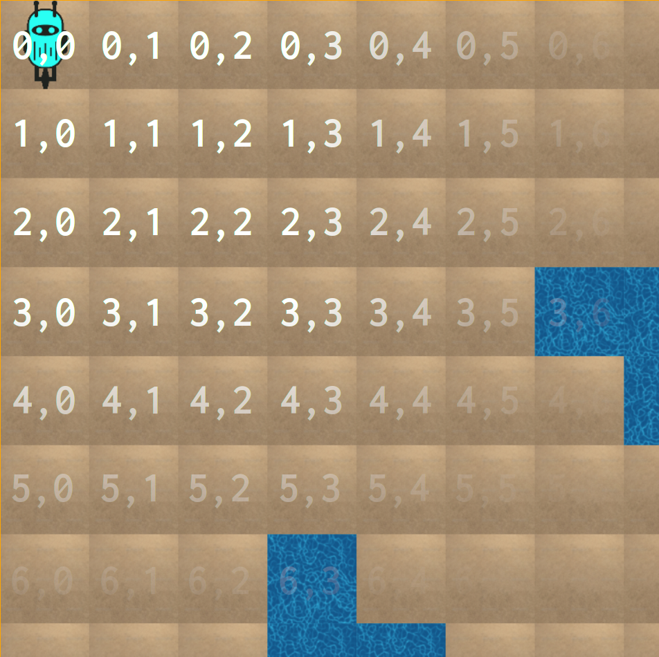
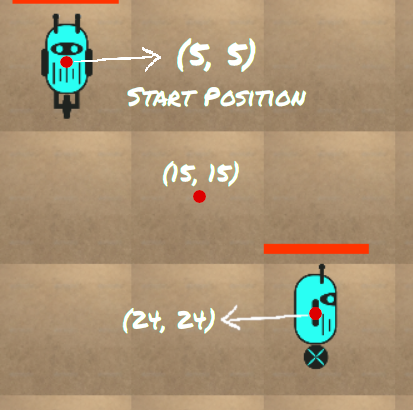
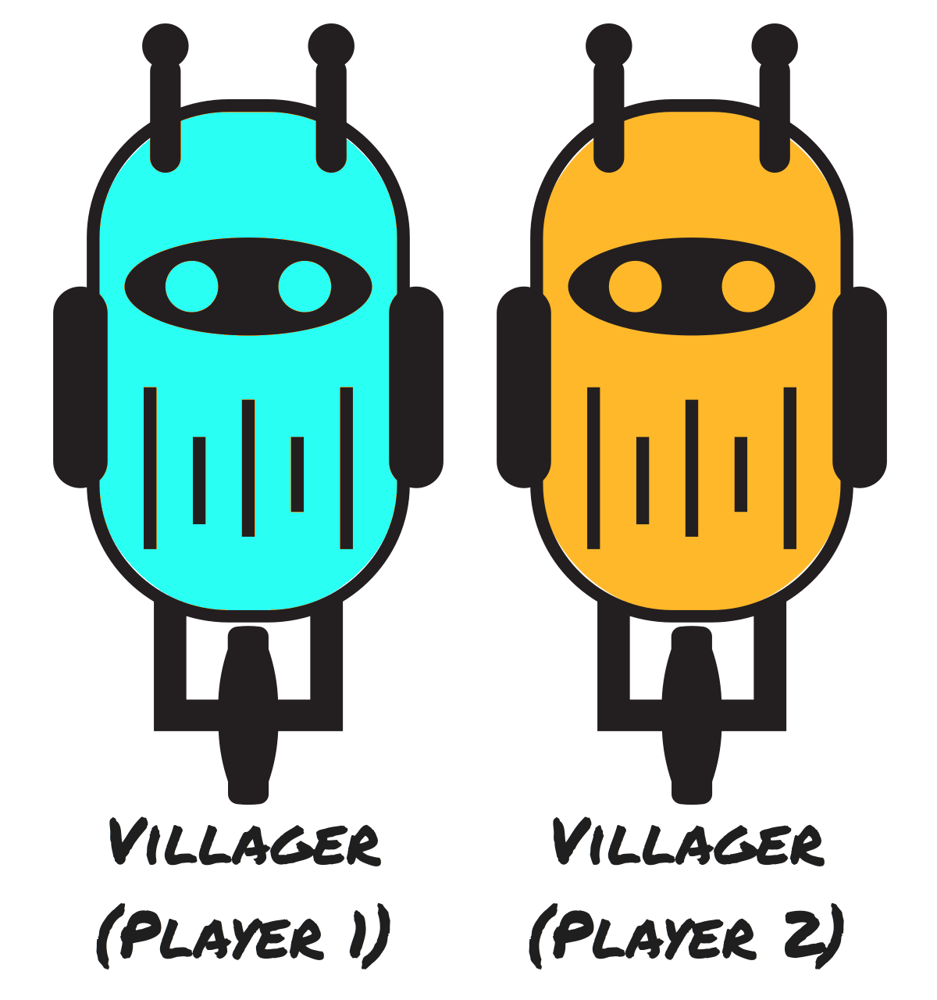
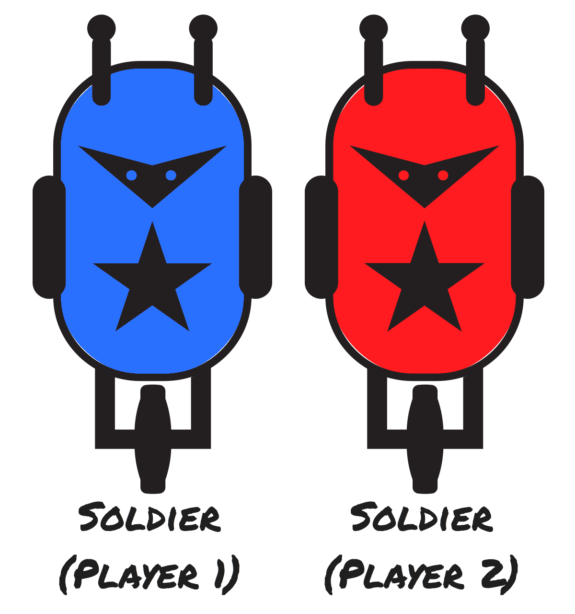
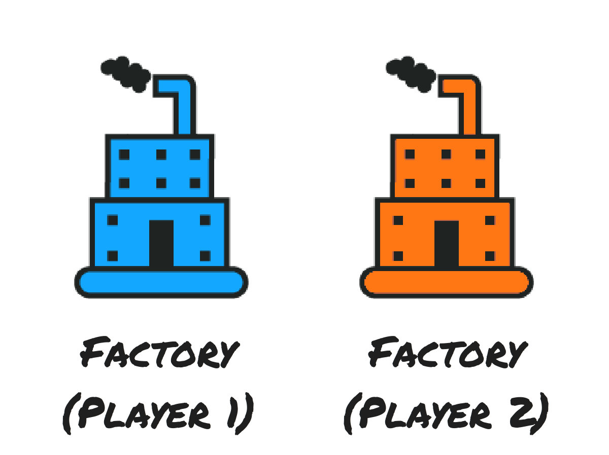

=====
Rules
=====

Game Board/Map
==============

Offsets
-------

The map is a square 30x30 grid of tiles. The origin is at the top-left corner. The X and Y coordinates in Vec2D corresponding to moving *down* and moving *right* respectively, similar to how a 2D array is indexed. Each of these grid elements is called an **offset**.

.. Tip:: You can get the width of the map in offsets through the ``MAP_SIZE`` constant

Positions
-------

Now, note that units like Villagers and Soldiers occupy subpositions within each of these offsets. Each offset is divided into **positions**. Each offset is ``10`` positions wide.

.. Tip:: You can access the number of positions in an offset through the constant ``ELEMENT_SIZE``

The map has different types of terrain - Land, Water and Gold Mines. Water is inaccessible to all units.

Units
=====

There are three types of units - villagers, soldiers and factories.

Villagers
---------

Villagers can move, mine the gold mines and build factories. They have low HP and low speed. They can attack the opponent's units but cause lesser damage than soldiers do. At any point of the game, you can only have ``MAX_NUM_VILLAGERS`` villagers.

Soldiers
--------

Soldiers can move and attack the opponent's units. They have higher HP and speed compared to villagers and can cause more damage to the opponent. At any point of the game, a player can have ``MAX_NUM_SOLDIERS`` soldiers.

Factories
---------

Factories can be built with Gold by Villagers on Land. They produce villagers or soldiers and have a high HP but cannot attack or move. A factory can switch between producing villagers or soldiers. A player can have upto ``MAX_NUM_FACTORIES`` factories at any point in the game.

.. Hint::
	For values of all these constants like ``MAX_NUM_FACTORIES`` and ``MAP_SIZE``, check the `Constants <constants.html>`_ page.

Starting the Game
=================

Each player begins with a set of villagers in their corner of the map and some initial amount of gold (the value of which can be accessed from ``GOLD_START``). Villagers can move, create factories and mine gold. Factories are stationary, and occupy an entire offset. Any offset on the map can contain only one factory. 

Villagers and soldiers can move and attack other units and factories of the opponent.

The API we provide is such that you need not worry about which side of the map you are on - it will always appear as if you are on the top-left corner and the enemy on the bottom right, regardless of if you're playing as Player 1 or Player 2.

At all times, assume your commands are being carried out as if you are Player 1. If you're playing as Player 2, we'll flip all of your commands and positions for you.

Goal
====

The goal is to eliminate your opponent by destroying all their units. You are also given a score based on resources and units. If the game crosses 1000 turns without any team having all units destroyed, the player with the higher score will be declared the winner.

A Turn
======

Players take turns giving commands to their troops. On each turn, your code's ``Update`` method is called, and you can use the state of the game to make decisions on what you'd like your units to do in that turn.

You can issue issue commands to your villagers, soldiers, and factories at every turn in the game.

You can give any commands to any of your units in each turn, but note that each actor can only accept one command. You cannot command a villager to mine and build in the same turn, for example.

You can instead issue the build command, maybe check to see if the factory construction is complete, and then issue a command to continue mining.

Soldier Commands
----------------

You can issue exactly one command to each of your soldiers in a turn (that is, each soldier can do one thing). You can either order your soldier to

1. Move to a location on the map (``soldier.move()``)
2. Attack a villager, soldier or factory (``soldier.attack()``)

Villager Commands
-----------------

You can issue exactly one command to each of your villagers in a turn. A villager can be ordered to do one of the following - 

1. Move to a location on the map (``villager.move()``)
2. Mine a goldmine to collect gold (``villager.mine()``)
3. Build a factory at an *offset* on the map (``villager.build()``)
4. Attack a villager, soldier or factory (``villager.attack()``)

Killing the opponents units gives you gold and points.

Factory Commands
----------------

A factory can be commanded to -

1. Start or stop producing units (``factory.stop()`` / ``factory.start()``)
2. Produce a different unit, either villager or soldier (``factory.produce_soldiers``/ ``factory.produce_villagers``)

Scoring
=======

You are rewarded for the following 

1. Killing an opponent's units (soldiers, villagers or factories)
2. Completing building a factory
3. Keeping your units alive. The more turns your units and factories stay alive, the more age bonusses you get.
3. The amount of gold you have left at the end of the game

Instruction Limit
=================

The number of instructions executed by each player's code per turn is counted while the match is being simulated. This is because there is a limit on the number of instructions that a player can execute per turn.

There are two instruction limits - a turn limit and a game limit. Crossing the turn limit (10 million instructions) on any turn makes that particular turn invalid. Crossing the game limit (30 million instructions) (even once) makes the player lose the entire match. You can see your instruction count for any turn as the game is executing.

End of the Game
===============

The game ends when one player destroys all of their opponents units. If neither player is able to do so, the game ends after a 1000 turns. In this case, the player with the highest score wins. If both players have an equal score at the end of 1000 turns, the match is declared a draw.

The game can also end prematurely due to any one player crossing the game instruction limit.

Furthur Reading
===============

Now that you know the rules of the game, you can try writing some code! To better understand the game API, please visit the `Player State <player_state.html>`_ page, which details how to read the game state information and issue commands to your units.
